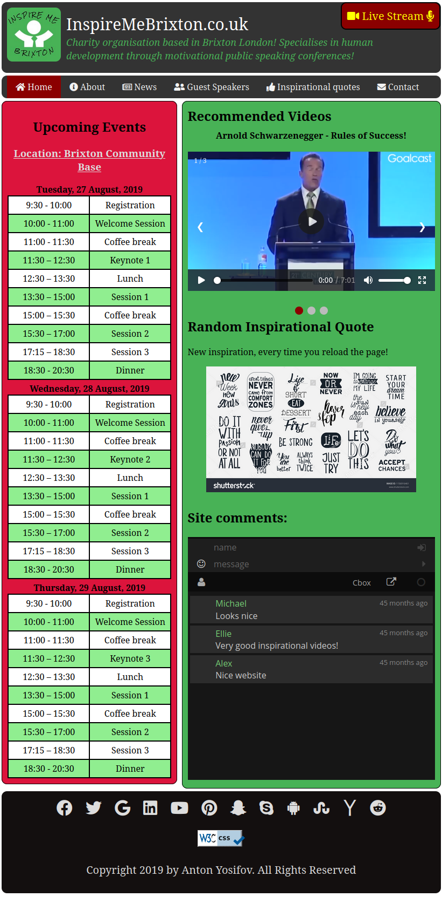
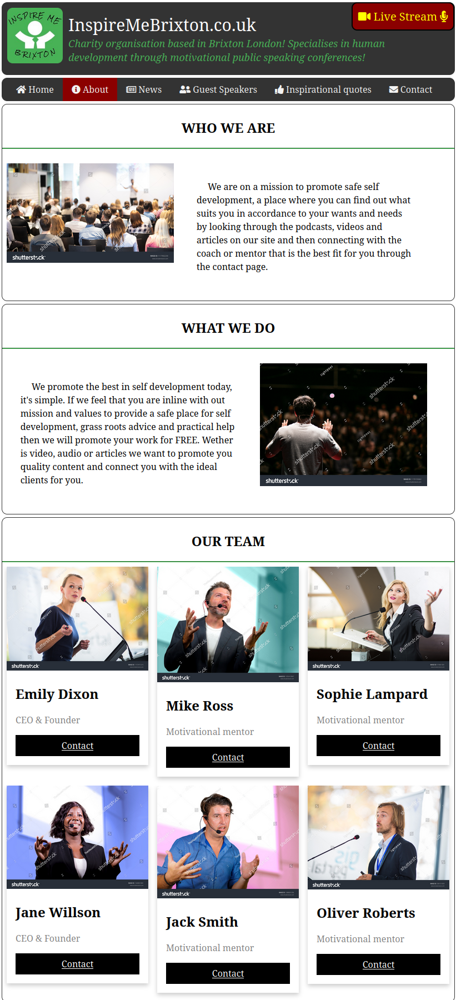
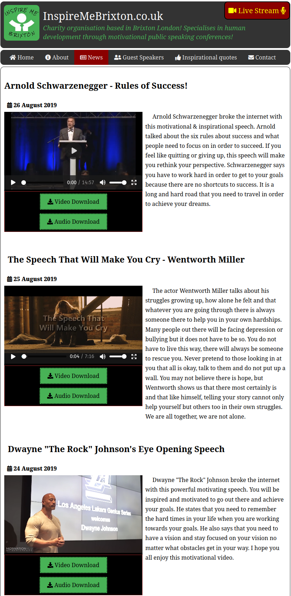
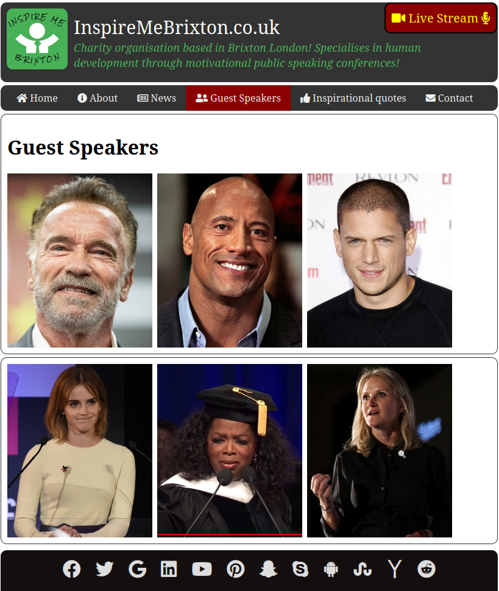
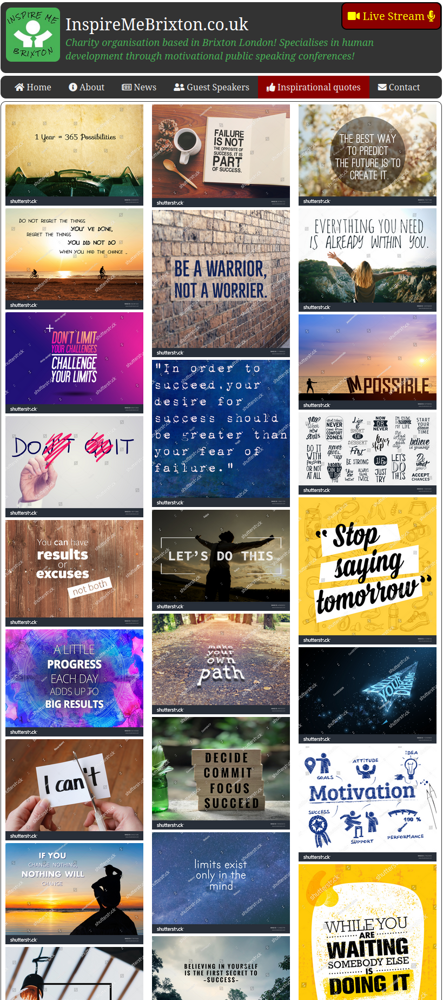
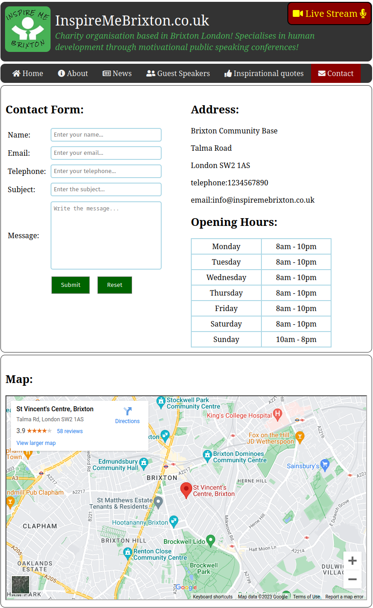

<a id="readme-top"></a>
<div align="center">
<h1 align="center">Inspire Me</h1>
<a href="https://github.com/apyosi/inspire-me/graphs/contributors"></a>
<a href="https://github.com/apyosi/inspire-me/network/members"></a>
<a href="https://github.com/apyosi/inspire-me/stargazers"></a>
<a href="https://github.com/apyosi/inspire-me/issues"></a>
<a href="https://opensource.org/licenses/MIT"></a><br>
<h2><a href="https://apyosi.github.io/inspire-me/" target="_blank"">View Demo</a></h2><br>
</div>
<details open>
  <summary>Table of Contents</summary>
  <ol>
    <li><a href="#description">Description</a></li>
    <li><a href="#installation">Installation</a></li>
    <li><a href="#screenshots">Screenshots</a></li>
    <li><a href="#usage">Usage</a></li>
    <li><a href="#contributing">Contributing</a></li>
    <li><a href="#tests">Tests</a></li>
    <li><a href="#license">License</a></li>
    <li><a href="#questions">Questions</a></li>
  </ol>
</details>

<h2 id="description">🧾 Description</h2>

Scenario:
InspireMe is a charity organisation based in Brixton London which specialises in human development through motivational public speaking conferences. They usually hold meetings where members/visitors attend and listen to a guest speaker who speaks on a specific topic. 

<p align="right">(<a href="#readme-top">back to top</a>)</p>

<h2 id="screenshots"> 🖼️ Screenshots</h2>

<!--


<-->
<a href="./demo/demo1.png"></a>
<a href="./demo/demo2.png"></a>
<a href="./demo/demo3.png"></a>
<a href="./demo/demo4.png"></a>
<a href="./demo/demo5.png"></a>
<a href="./demo/demo6.png"></a>


<p align="right">(<a href="#readme-top">back to top</a>)</p>

<h2 id="built-with">🛠️ Built with</h2>

<a href="https://developer.mozilla.org/en-US/docs/Glossary/HTML5" target="_blank" rel="noreferrer" ></a>
<a href="https://www.w3.org/TR/CSS/#css" target="_blank" rel="noreferrer" ></a>
<a href="https://developer.mozilla.org/en-US/docs/Web/JavaScript" target="_blank" rel="noreferrer" ></a>
<a href="https://www.php.net/" target="_blank" rel="noreferrer" ></a>
<a href="https://fontawesome.com/" target="_blank" rel="noreferrer" ></a>

<p align="right">(<a href="#readme-top">back to top</a>)</p>

<h2 id="installation">💾 Installation</h2>

Clone the repository: 
```git@github.com:apyosi/Project-Name.git```

<p align="right">(<a href="#readme-top">back to top</a>)</p>

<h2 id="contributing">🧑🏻‍🔧 Contributing</h2>

Contributions are always welcome!

Contributions are what make the open source community such an amazing place to learn, inspire, and create. Any contributions you make are greatly appreciated.

If you have a suggestion that would make this better, please fork the repo and create a pull request. You can also simply open an issue with the tag "enhancement". Don't forget to give the project a star! Thanks again!

1. Fork the Project
2. Create your Feature Branch `git checkout -b feature/AmazingFeatur`)
3. Commit your Changes `git commit -m 'Add some AmazingFeature`)
4. Push to the Branch `git push origin feature/AmazingFeatur`)
5. Open a Pull Request


<p align="right">(<a href="#readme-top">back to top</a>)</p>

<h2 id="license">🔍 License</h2>

<a href="https://opensource.org/licenses/MIT"></a>

<p align="right">(<a href="#readme-top">back to top</a>)</p>

<h2 id="questions">❓ Questions</h2>

You can reach me for any questions on the github repo page: [https://github.com/apyosi/inspire-me](https://github.com/apyosi/inspire-me)

<p align="right">(<a href="#readme-top">back to top</a>)</p>

<h2 id="questions">💌 Acknowledgments</h2>

* [Best README Template](https://github.com/othneildrew/Best-READMETemplate)
* [Badges 4 README.md Profile](https://github.com/alexandresanlim/Badges4-README.md-Profile)
* [Markdown License badges](https://gist.github.com/lukas-h/2a5d00690736b4c3a7ba)
* [Shutterstock images](https://www.shutterstock.com/)
* [Youtube videos](https://www.youtube.com/)
* [Google Maps](https://www.google.com/maps)
  

